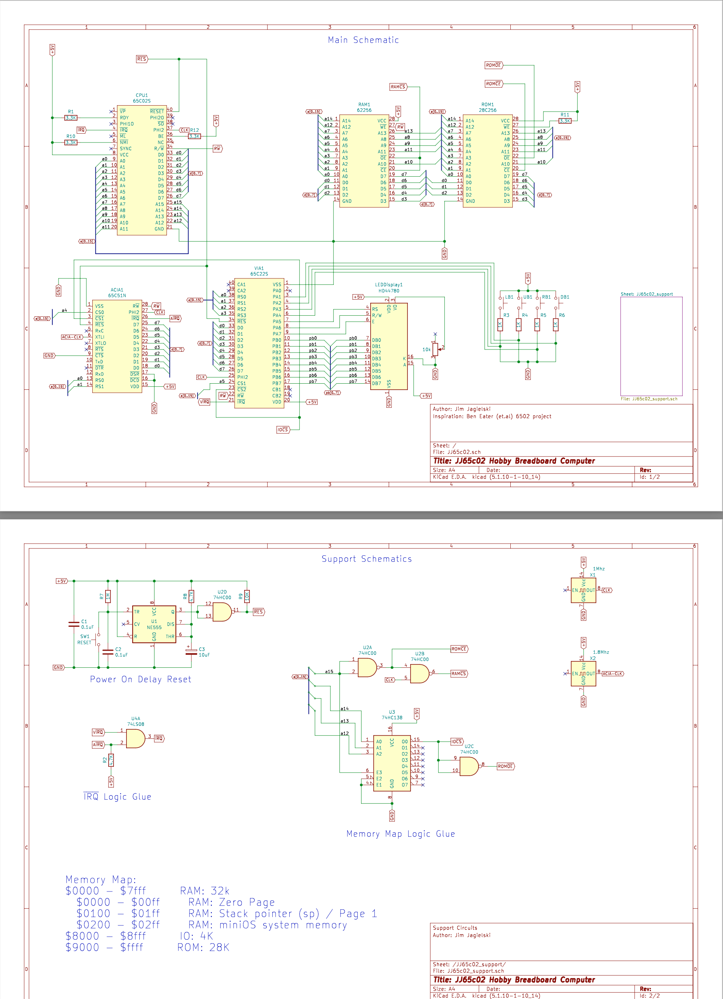
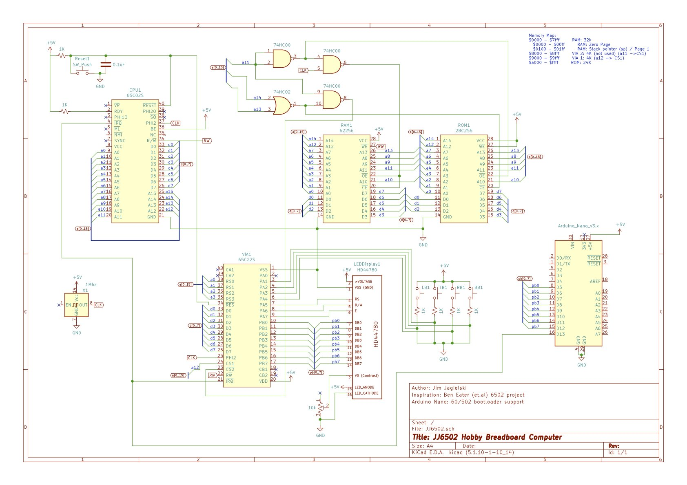
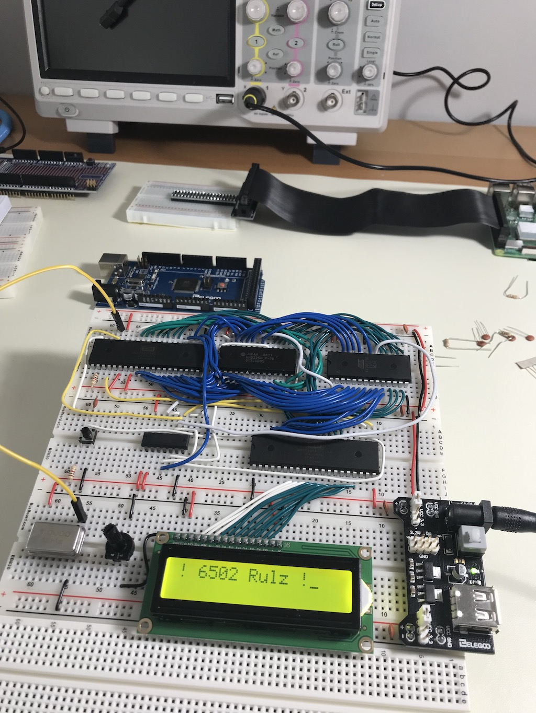

# History and Changelog for the JJ65c02 Project

## Intro

This document is mostly for my own personal note taking,
but hopefully it will also be useful to anyone who
comes across this project (I don't expect a lot of
traffic... :/ ). All code and examples are available under
permissive Open Source licenses, so please don't hesitate
to use, and re-use, what you need.

## The Historical Documents

### Oct 10, 2021

#### The memory map:

The current memory map is as efficient and as functional as
I could devise (currently, that is). The intent was to maximize
RAM, and then ROM, and then ensure adequate set-aside for I/O.

To that end, the address and chip select decoder logic for
RAM is super easy. If _a15_ is 0, then we're in RAM space,
and we can use the full 32k. Alternatively, _a15_ high (1),
means we are in ROM territory, but we also want to carve out
a small chunk of that space for I/O.

For I/O, the design uses the `W65c22` and the `w65c51`
as the VIA and ACIA chips, respectively. Now most I/O, especially
using these chip, don't need a large address space, and
even 4K is excessive, but workable. To maximize ROM space,
I use a `74hc138` and consider the states of address lines _a14_, _a13_
and _a12_. If these are all low (0), then, with _a15_ also low,
that maps to the $8000-$8fff address space. We can use that as
a chip select for the I/O chips; If any are high however, that
means that we are in ROM space, and so we can use that as the
other ROM chip select signal.

So now that we are choosing the I/O chips, how do we determine _which_ chip
we actually want to enable? What I came up with is an elegant solution
where address lines _a4_, _a5_,... are used for the secondary
chip select. So, in this case, if _a4_ is high, we select the ACIA;
if _a5_ is high, we pick the VIA. We can continue this way for up
to 6 more chips. This leaves _a3_->_a0_ to select the actual address
in these mini-blocks allocated per chip:

```
a11  a10  a9  a8  a7  a6  a5  a4  |  a3 a2 a1 a0  |    Address
  0    0   0   0   0   0   0   1  |   x  x  x  x  |  $8010-$801f
  0    0   0   0   0   0   1   0  |   x  x  x  x  |  $8020-$802f
  0    0   0   0   0   1   0   0  |   x  x  x  x  |  $8040-$804f
  0    0   0   0   1   0   0   0  |   x  x  x  x  |  $8080-$808f
  0    0   0   1   0   0   0   0  |   x  x  x  x  |  $8100-$810f
  0    0   1   0   0   0   0   0  |   x  x  x  x  |  $8200-$820f
  0    1   0   0   0   0   0   0  |   x  x  x  x  |  $8400-$840f
  1    0   0   0   0   0   0   0  |   x  x  x  x  |  $8800-$888f
```

Note that overlapping address spaces (like $8030, where _a4_ *and* _a5_
are both 1) are not used since this would select multiple I/O chips.

--

### Oct 5, 2021

Updated the schematics and the code for the new memory map. Kinda premature
though since I haven't yet physically changed the breadboard yet. Still,
I think there should be no problem.

```
MEMORY
{
  ZP:   start = $0,    size = $100,  type = rw, define = yes;
  RAM:  start = $0200, size = $7e00, type = rw, define = yes, file = "%O.bin";
  IO:   start = $8000, size = $1000, type = rw, define = yes, fill = yes, fillval = $ea, file = %O;
  ROM:  start = $9000, size = $7000, type = ro, define = yes, fill = yes, fillval = $ea, file = %O;
}

SEGMENTS {
  ZEROPAGE:  load = ZP,  type = zp,  define = yes;
  SYSRAM:    load = RAM, type = rw,  define = yes, optional = yes, start = $0200;
  PROG:      load = RAM, type = rw,  define = yes, optional = yes, start = $0300;
  DATA:      load = ROM, type = rw,  define = yes, optional = yes, run = RAM;
  BSS:       load = RAM, type = bss, define = yes, optional = yes;
  HEAP:      load = RAM, type = bss, define = yes, optional = yes;
  CODE:      load = ROM, type = ro,  define = yes,  start = $a000;
  RODATA:    load = ROM, type = ro,  define = yes, optional = yes;
  RODATA_PA: load = ROM, type = ro,  define = yes, optional = yes, align=$0100;
  ISR:       load = ROM, type = ro,  start = $ffc0;
  VECTORS:   load = ROM, type = ro,  start = $fffa;
}
```



Even though I don't ever expect to move to using PCBs, wirewrapping is the next and likely final step, I decided to play around with designing and laying
out the design. Kicad makes it easy and the opensource `Freerouting` tool does a pretty good job auto-routing the traces. After all was said and done, I started
rethinking whether or not one day I may just try implementing JJ65c02 on a PCB.

--

### Oct 2, 2021

Switched out the `R6551` for the `WDC65C51`. Finished all the wiring
and did a quick smoke test of the TTY interface at 19200 baud. Works
like a dream. Next step is to rip out the IRQ-based bootloader and
use the ACIA to handle the transfer.

I have been mulling over 2 improvements to the setup. One is a
automated power-on delay reset, which is a pretty common, standard,
and easy improvement. The 2nd is readjusting my memory map, again.
8k set aside for I/O (VIA and ACIA address space) just seems like
overkill. Using my present glue logic with a `74HC138` would make
it easy to allocate just $8000-$8fff to I/O and reclaim 4k for ROM.

--

### Sept 29, 2021

Decided to take full advantage of `cc65` and started a major refactoring
of the codebase. Now, each functional aspect is separated out into their
own individual files, with `.h` and `.inc` files to allow reuse by other
ROM and (User) RAM programs.

Also added in some initial attempts of `xmodem` and `tty` access modules
to take full advantage of the ACIA/6551 chip. This means that we'll start
using the serial functions of the chip for the `bootloader`.

My initial thoughts were to use the `R6551`, and that's still the one
wired in. The main reason was that it supported `IRQ` notices, whereas
the more recent `W65C51` chip is known to be broken in that regard.
So whereas you can use `IRQ` to know when various buffers are ready with
the `R6551`, you need to simply poll-and-wait with the newer one.
But I really want to see how fast I can reliably run the `JJ65c02`
and the older chip is limited to 2Mhz, whereas the newer one can
go as fast as the `65c02`.

Although some people support both options, it requires a re-assembly
of the source. I've decided to keep things simple and will just
use poll-and-wait universally. It makes the code easier and is
really just as efficient as using `IRQ` at this level.

--

### Sept 27, 2021

Simple name-change from `bootloader` to `minios`.

--

### Sept 21, 2021

Not a lot of good info about the 20x4 LED Displays and what
there is is kind of conflicting. But finally figured out how
to set the cursor to the row and column I need. Started adjusting
the code and libraries to both use the 20x4 display but also
be backwards compatible with the 16x2.

For Up/Down scrolling right now I use large blocks of text,
already fixed in a 20 column format, padded with spaces. This
makes the code and implementation easier, but is quite wasteful.
Thinking about using pointers, but is it worth the time and
effort?

Got the MAX232 in the mail so went ahead and soldered the
pins in. Still need to wire it in but we're making progress!


--

### Sept 18, 2021

I decided I needed a better way to load programs into
RAM. The sixty502 bootloader does well enough, but
the dependency on a Nano seems limiting to me. Bite
the bullet and decide to instead use the 6551 ACIA
chip for serial I/O. This will eventually also allow
me to connect to the system via a serial `tty` interface.
Although old, and somewhat limited, common knowledge seem
to be to use the old Rockwell R6551, instead of the newer
65c51, because the latter has some nasty timing bugs.

I've seen some people add in USB and VGA to their 6502
projects. This seems like overkill. The whole allure, for
me at least, is the old-school aspect of the project.
Another reason to drop the Nano. Will keep the
mini-keyboard and the LCD display though: will likely
use that as the main menu and as supplemental IO.

With both the VIA (65c22) and the ACIA chip (R6551), I think that
simply tying both to the `IRQ` line will likely work, but isn't
ideal. Since the R6551 is an open drain design, I use a 4.7K pullup
on its IRQ line and feed it and the 65c22 IRQ  into a 74HC08 `AND` gate
and use that output to drive the `IRQ` input to the 6502.

Looked around for a TTL-serial converter. Found one on
[Digi-key](https://www.digikey.com/en/products/detail/mikroelektronika/MIKROE-222/4495513), so placed an order.

In the meantime, pulled out the Nano and started wiring
up the 6551. Times like this one really appreciates breadboards.

--

### Sept 16, 2021

As with others, found that `vasm`, while a great assembler,
has its limitations. Needed something a bit more
finely suited to larger 6502 assembler projects. Started
migrating code to `cc65`.

`cc65` requires a `cfg` file, which tells the linker
where to put stuff. This looks like a good inital version:

```
MEMORY
 {
   ZP:   start = $0,    size = $100,  type = rw, define = yes;
   RAM:  start = $0230, size = $7dd0, type = rw, define = yes;
   VIA2: start = $8000, size = $1000, type = rw, define = yes, fill = yes, fillval = $ea, file = %O;
   VIA1: start = $9000, size = $1000, type = rw, define = yes, fill = yes, fillval = $ea, file = %O;
   ROM:  start = $a000, size = $6000, type = ro, define = yes, fill = yes, fillval = $ea, file = %O;
 }

 SEGMENTS {
   ZEROPAGE:  load = ZP,  type = zp,  define = yes;
   DATA:      load = ROM, type = rw,  define = yes, run = RAM, optional = yes;
   BSS:       load = RAM, type = bss, define = yes, optional = yes;
   HEAP:      load = RAM, type = bss, define = yes, optional = yes;
   CODE:      load = ROM, type = ro,  define = yes,  start = $a000;
   RODATA:    load = ROM, type = ro,  define = yes;
   ISR:       load = ROM, type = ro,  start = $ffc0;
   VECTORS:   load = ROM, type = ro,  start = $fffa;
 }
```
--

### Sept 13, 2021

Found a pretty cool x6502 emulator. Folded it into the overall project
and made the modifications required for my setup. Added actual
user documents to the project too.

Starting thinking about switching the 16x2 LCD display with
a 20x4. The extra space will come in handy.

--

### Sept 8, 2021

Decide to put everything up on [Github](https://github.com/jimjag/JJ65c02).

--

### Sept 3, 2021

Decided that I really need to start generating schematics. I don't
ever expect to go the PCB route, but will likely end
up wire-wrapping at some point. Plus, it's good to actually
document what connects to what, etc. Chose KiCad.


--

### Sept 1, 2021

Found Jan Roesner's [sixty502](https://github.com/janroesner/sixty5o2) project, which uses an Arduino and bootloader to load programs into RAM. So
I [fork](https://github.com/jimjag/sixty5o2) the project and start
modifying it for my newly-named JJ65c02 project.

--

### ~Aug 30, 2021

First step on some improvements. First of all, Ben's memory map isn't ideal
(he admits as much) and I wanted to allocate as much space
for RAM as possible. Came up with an address decoder which only
requires 1 additional chip, but allows for 32k RAM, 24k ROM
and 2 4K VIA/IO address blocks. Those IO blocks are still
huge for my needs, but right now, they are good enough.

--

### Aug 26, 2021

While playing around on Youtube, I came across the various
[Ben Eaters 6502 Computer](https://eater.net/6502) videos
and addition to being impressed with his style, skill and
knowledge, I also became intrigued. Back as an undergrad
at JHU, one of my courses was in microprocessor architecture,
and a project was a 6502 breadboard setup. I can't recall
the full specifics; I am pretty sure that other than RAM
and ROM (maybe 8k of each), there were no other 6502-family
chips used in the project. Just some logic gates, switches
and LEDs. Still, I had a blast with the project and took my
time to plan every detail, both from a hardware placement
standpoint to software design. When all was done, I was
extremely proud of what I did and was also shocked when
the Prof was just as impressed. He kept my wirewrap (no
pushboards back then) and code as a prototype example for
display in the course.

My first computer was, as with many, an Apple ][, which
was also 6502 based, and I spent many, many, many hours
coding on that, in both assembly and Basic. The skills
I learned doing assembly language programming are still
valuable to this day.

So when I saw Ben's videos, I was hooked.

I ordered Ben's kit (I always like supporting people)
and jumped into making my own version. As can be seen, it's pretty much a 1-1 match of Ben's version.

