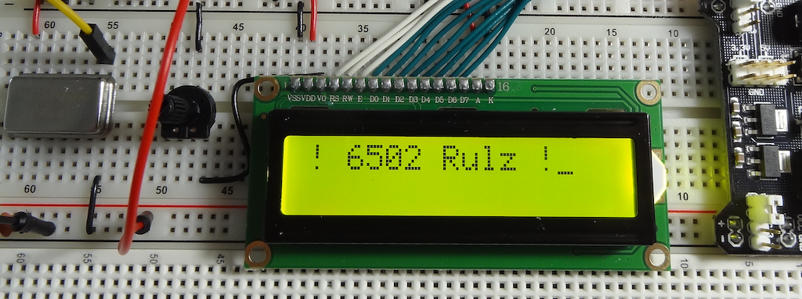

# Introduction

**JJ65c02** is my own personal interpretation of the noteworthy [Ben Eaters 6502 Computer](https://eater.net/6502) setup. In addition to Ben's work, I've used code, concepts and inspiration from a number of people, all acknowledged below in the **Credits** section. The ultimate inspirations are the venerable Apple II and the Atari 800 personal computers

This project contains 3 main sections:

* The actual JJ65c02 breadboard computer ([Schematics](./Schematics))
* [Software](./Software)
  * The miniOS OS menu and ROM bootloader
  * pico-code : The RP2040/RP2350 A/V chip (VGA driver and PS/2 keyboard interface)
  * x65c02 Emulator
* [Datasheets](./Datasheets)

Each section has its own Readme.md and Folder under this repo.

# Updates

Keep up to date by following the project on [Hackaday](https://hackaday.io/project/193153-jj65c02) and our [YouTube channel](https://www.youtube.com/playlist?list=PLI32OMXu1rudGl28vJc05QFXHkXWn0A19). Older notes can be found by reading the [History](./HISTORY.md) file, which served as a running log of additions and improvements.

# Pull Requests

If you would like to see any particular feature I would be happy to accept any actual code contributions via Pull Requests, or even Enhancement requests. I am happy to screen, test and merge any valuable PR.

# Contact

You can, of course, contact me via the normal Github development methods, such as Issues, Pull Requests, etc. You can also ping me via [Email](mailto:jimjag@gmail.com) and follow me/DM me on [Twitter](https://twitter.com/jimjag/)

# Credits

* Specific content noted in their respective sections
* All the helpful peeps on reddit r/beneater/
