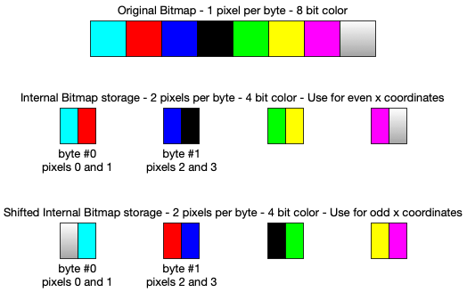

# JJ65c02: The RP2040/RP2350 Console Chip

`pico_core` serves as the core code for the rp2040/rp2350 Pi Pico support chip for the JJ65c02 SBC. It performs 4 main functions:

* Interfaces with a PS/2 keyboard for console input
* Outputs VGA at 640x480, 4-bit color
* Provides Smart Terminal, Graphics and Text mode primitives
* Sound generation and output (4 voices, 10 tones)

## PS/2 Keyboard

2 __GPIO__ pins are used on the Pi Pico for the PS/2 data and clock signals. Data is
read and serialized using a __PIO__ state machine. This data is then fed into the
VGA/terminal subsystem (if desired) as well as sent to the JJ65c02 system using 7 pins on
the VIA chip and one pin for the data handshake. In general, we expect the 6502 to echo back
any characters rec'd/sent from the PS/2 system.

PS/2 scancodes are translated to ASCII, and support uppercase, lowercase and
control characters. The __arrow keys__ are specially handled and mapped
to ASCII `0x11` through `0x14`.

## VGA Output

The Pi Pico supports a resolution of 640x480 pixels at 60Khz, with a 4 bit
color palette. The `HSYNC`, `VSYNC` and `RGBI` signals are generated using
3 __PIO__ state machines with 6 output pins. Higher resolutions are possible
but are limited by the onboard memory available on the __RP2040__.

The display itself is fully bitmapped, allowing for each individual pixel
to be directly addressed.  Changes to the bitmap are automatically reflected
in the output using the __Pico__ DMA capability. Internally, each pixel is stored in 4bits of 1/2 of byte (ie: 2 pixels per byte), substantially reducing the memory footprint of the bitmapped display.

Character bytes can be written to the __Pico__ from the 65C02 by simply writing
to the Pico's mapped direct address. This uses 8 pins on the Pico for the
data and 1 pin to serve as a `write/data-ready/chip-select` signal.

## Terminal: Graphics and Text

Included in the VGA subsystem is a set of text and graphics primitives. Note that these are only guaranteed to work on the VGA console (although the generic escape sequences should work via the serial connection to any vt100 compliant emulator). These include:

### Graphics

* Drawing a pixel
* Drawing a line
* Drawing an outlined rectangle
* Drawing a filled rectangle
* Drawing a circle
* Drawing a filled circle

### Terminal/Text

* 80x30 screen size (8x16 fonts)
* Multiple font glyphs
* * Sweet 16 font ([preview](./font_previews/sweet16-preview-8x16.png)) | Font #0
* * ACM font ([preview](./font_previews/acm-preview-8x16.png)) | Font #1
* * Toshiba font ([preview](./font_previews/toshiba-preview-8x16.png)) | Font #2
* * Sperry font ([preview](./font_previews/sperry-preview-8x16.png)) | Font #3
* Fully addressable cursor
* Blinking cursor
* Smooth and Jump scrolling
* A subset of ANSI/Xterm/VT100 escape sequences

### Supported Escape Sequences

#### Standard

* `ESC[<n>A` Move text cursor up `<n>` lines (Arrow Up)
* `ESC[<n>B` Move text cursor down `<n>` lines (Arrow Down)
* `ESC[<n>C` Move text cursor right `<n>` cells (Arrow Right)
* `ESC[<n>D` Move text cursor left `<n>` cells (Arrow Left)
* `ESC[H` Move text cursor to home `(1,1)`
* `ESC[x;yH` Move text cursor to terminal location `(x,y)`
* `ESC[2J` Clear entire screen
* `ESC[<n>S` Scroll up `<n>` lines
* `ESC[?4h` Enable smooth scrolling
* `ESC[?25h` Enable/show cursor
* `ESC[?4l` Disable smooth scrolling - use jump scrolling
* `ESC[?25l` Disable/hide cursor
* `ESC[0m` Reset to default foreground (FG) and background (BG) colors
* `ESC[7m` Reverse colors (swap FG and BG)
* `ESC[<30–37>m` Set FG color to `<30-37>`(ANSI color)
* `ESC[38;5;<n>m` Set FG color to `<n>` (RGB)
* `ESC[<40–47>m` Set BG color to `<40-47>`(ANSI color)
* `ESC[38;5;<n>m` Set BG color to `<n>` (RGB)
* `ESC[s` Save text cursor position
* `ESC[u` Move text cursor to saved position

NOTE: Text cursor positions are 1-based: (1,1) to (80,30) in keeping with ANSI terminal standards.

#### Extensions

* `ESC[Z;<c>Z` Write character `<c>` at current text cursor position
* `ESC[Z1;<code>Z` Send ascii char decimal code`<code>` to the rp2040 Sound `soundTask()` function (see `pico_synth_ex.c`). For example, `ESC[Z1;101Z` will send `e` to `soundTask()` to play a single `Mi` note
* `ESC[Z2;<color>Z` Set FG color to `<color>`
* `ESC[Z3;<color>Z` Set BG color to `<color>`
* `ESC[Z4;<x>,<y>Z` Draw pixel at `(x,y)` with current FG color
* `ESC[Z5;<x>;<y>;<c>Z` Graphically draw the char `<c>` with its upper left corner starting at pixel location (x,y)
* `ESC[Z6;<x0>;<y0>;<x1>;<y1>Z` Draw line from `(x0,y0)` to `(x1,y1)` with current FG color
* `ESC[Z7;<x>;<y>;<w>;<h>Z`Draw rectangle starting at `(x,y)` with width `w` (x-axis) and height `h` (y-axis)
* `ESC[Z8;<x>;<y>;<w>;<h>Z`Draw filled rectangle starting at `(x,y)` with width `w` (x-axis) and height `h` (y-axis)
* `ESC[Z9;<x>;<y>;<r>Z`Draw circle with center at `(x,y)` radius `r`
* `ESC[Z10;<x>;<y>;<r>Z`Draw filled circle with center at `(x,y)` radius `r`
* `ESC[Z11;<x>;<y>;<w>;<h>;<r>Z`Draw rounded rectangle starting at `(x,y)` with width `w` (x-axis) and height `h` (y-axis) and corner radius of `<r>`
* `ESC[Z12;<x>;<y>;<w>;<h>;<r>Z`Draw filled rounded rectangle starting at `(x,y)` with width `w` (x-axis) and height `h` (y-axis) and corner radius of `<r>`


Pixel locations are 0-based: (0,0) to (639, 479).

Graphics (lines, circles, ...) use FG color for their color.

Our color set uses:
```
RGB:         RGB332:      Us:
--------      ----      ------------
0x000000  ->  0x00  ->  Black
0xc00000  ->  0xc0  ->  Red
0x00c000  ->  0x18  ->  Green
0xc0c000  ->  0xd8  ->  Yellow
0x0000c0  ->  0x03  ->  Blue
0xc000c0  ->  0xc3  ->  Magenta
0x00c0c0  ->  0x1b  ->  Cyan
0xc0c0c0  ->  0xdb  ->  Light Grey
0x808080  ->  0x92  ->  Grey
0xff0000  ->  0xe0  ->  Bright Red
0x00ff00  ->  0x1c  ->  Bright Green
0xffff00  ->  0xfc  ->  Bright Yellow
0x0080ff  ->  0x13  ->  Bright Blue
0xff00ff  ->  0xe3  ->  Bright Magenta
0x00ffff  ->  0x1f  ->  Bright Cyan
0xffffff  ->  0xff  ->  White

0xffc0cb/*  ->  0xfb  ->  Transparent  // All other colors are assumed to be transparent

enum colors { BLACK=0x00, RED=0xc0; GREEN=0x18, YELLOW=0xd8,
    BLUE=0x03, MAGENTA=0xc3, CYAN=0x1b, LIGHT_GREY=0xdb,
    GREY=0x92, LIGHT_RED=0xe0, LIGHT_GREEN=0x1c, LIGHT_YELLOW=0xfc,
    LIGHT_BLUE=0x13, LIGHT_MAGENTA=0xe3, LIGHT_CYAN=0x1f, WHITE=0xff,
    TRANSPARENT=0xfb };

```

When creating graphics, including Sprites and Tiles, use the above RGB colors
for the master copies and then use software such as
`./lv_img_conv.js -c CF_TRUE_COLOR -f` to create an RGB332 bitmap from
the RGB image itself (see https://github.com/lvgl/lv_img_conv). You can also create the bimap directly, using the
RGB332 values as well. When Sprites and Tiles are loaded, the RGB332 colors,
including transparency, are converted to our internal colors. When specifying
colors for graphic primitives (eg: `ESC[Z2;<color>Z`), the color must
be in the corresponding RGB332 value noted above.

## Sprites and Tiles
We support 2 sizes for Sprites and Tiles: 16pixel widths and 32pixel widths. Heights are variable and can be any size. The difference between the 2 is that Sprites can be moved around the screen, whereas Tiles are assumed to be fixed in place. Their creation is the exact same process, so I will use the term Sprite for both.

### Overview
Basically, one designs a Sprite in a graphics editor (such as GIMP or Aseprite) and exports it as a bitmap (*.bmp) file. Be sure to use the color values noted above for the RGB332 values. Then `lv_img_conv.js` is used to create the C array of RGB332 values for the Sprite (look for the `#if LV_COLOR_DEPTH == 1 || LV_COLOR_DEPTH == 8` section in the generated *.c file).

To use the Sprite, one must first load it into the VGA subsystem using the `loadSprite()` function. This will allocate memory for the Sprite and copy the RGB332 values into it. It will also create additional memory for use when the Sprite is moved around the screen. The Sprite can then be drawn to the screen using the `drawSprite()` function.

### Background and Transparency
Due to the way the VGA subsystem works, and especially the fact that all graphics are drawn to a single bitmapped display, Sprites and Tiles need to have the concept of a "transparent" pixel. This is achieved by using a special color value which is reserved for transparency. This color value is `0xfb` and is used to indicate that the pixel should be transparent.

When a Sprite is drawn to the screen, the VGA subsystem will first place a copy of the background that will be covered up by the Sprite into temporary storage. Then, using a combination of XOR and masking, the Sprite is drawn to the display. When the Sprite is moved, if the `erase` flag is set, the original background will be restored, and the Sprite will be drawn at the new location. This prevents having to redraw the entire screen when moving a Sprite around.

NOTE: Care must be taken in situations where a Sprite is drawn over another Sprite. The ordering of drawing Sprites is important due to the storage of the backgrounds. In such cases, the last moved Sprite should be the first moved in the next round.

### Pixel by Pixel Movement
There is one important consideration in the handling of Sprites (and Tiles) when placing them on the screen. Recall that in design of the VGA system, we have 2 pixels per byte of screen memory. So when we write to an even x coordinate, we are actually also writing the Sprite or Tile data for the pixel in the next column as well (1 byte data transfers). The result would be that even if we called the drawing routine to move the Sprite left or right by 1 pixel, it would remain at the same location on the screen. Basically, all Sprites and Tiles would only be placed on even x coordinates and the smallest movement possible for Sprites would be 2 pixels. Admittedly, at 640x480 resolution, and being a retro implementation, this would be fine.

However, what we do is create a shifted version of the Sprite and Tile bitmap so that _internally_ we can simulate pixel by pixel movement by using the shifted bitmap data. Basically, we have 2 versions of the Sprite bitmap: one for even and one for odd x coordinates. We built the latter one on the fly.

The takeaway from all this is that when creating your Sprites, they should be bounded on the left and right hand sides by a column of transparent pixels. Tiles should be bounded on the left and right by whatever color the background is.


